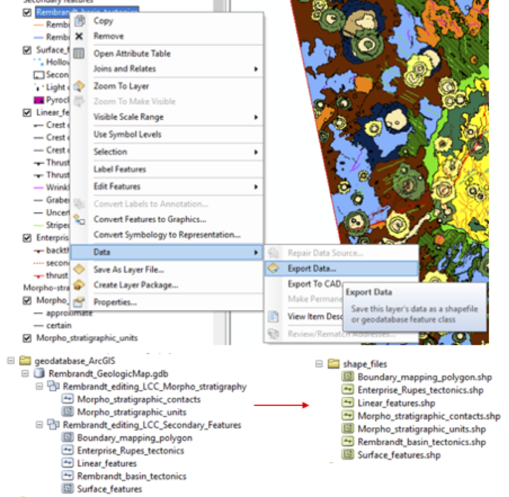
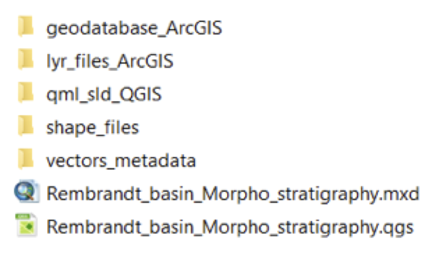

# Project transfer from ArcMAP to QGIS

* Export each feature class (polygon, polyline, point) into shape files Regardless of the subdivision of the input ArcGIS geodatabase, it is better to include all the output shape files within the same folder.

* Open a new QGIS project and import all the shape files.

* Edit the symbology of all the shape files. For the polygon shape files (e.g. geo-units) use the same RGB colours of ArcMap, and for all the other features (e.g. faults, craters, and in general all surface features with complex filling pattern), try to recreate the symbology as most similar as possible to the original one.

* For each layer, export the symbology created in QGIS into both the QML and SLD format.

N.B.: QML is the QGIS format, which preserves all the details of the symbols created in QGIS; SLD is the standard style file, readable by all GIS software, but does not preserve complex symbols (e.g. fault triangles and pattern fills)

* Save as **both** QML and SLD files

N.B.: (If not already done) also from ArcMap, export each feature class into layer files (.lyr), the standard ESRI style file.

* Save the QGS project (either in .qgs or .qgz), in the same folder of the ArcGIS project.
The following folder subdivision is suggested.

(vector_metadata contains the.xml metadata of all the vector layers - OPTIONAL)

* Create Geopackage: create a new geopackage, exporting one of the shape files (no matter which one first) into a new gpkg file (right click on the shape file  export  save feature as).

Once the gpkg is created, drag and drop all the shape files into the geopackage. The view from the browser should look like this:

* Add all new layers from the geopackage to the project (double click all the layers from the list within the gpkg). These new layers will have NO simbology. In order to save all layer styles INTO the gpkg:
- load the QML style previously saved for each layer (the ones just uploaded from the gpkg) (properties --> symbology --> style --> load style --> load the relative QML for each layer).

* once the QML style is loaded to these gpkg layers (check the correct symology), go back to the layer properties --> Style --> Save style --> and choose “In Geodatabase (geopackage) - see below.

* Once all the styles are loaded, close and open again the layers within the gpkg to verify the style has been succesfully updated.
