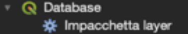

# How to create a geopackage with styles (and style)

•	Drag the .gdb folder into Qgis, it opens with uncategorized shapefiles that need to be sorted
•	Go to “Processing”->”processing tools” and in the search bar look for “geopackage”
•	Double click the "Package layers” tools

•	Select all the shapefiles you want in the geopackage and choose an output folder
•	Once saved, open a new Qgis and drag the .gpckg file. It loads with a random symbology and no sorting within the same shapefile
•	Double click on the shapefile properties and go to “Simbology”
•	You need to select “simbology with rules” like in the attached picture

•	With the “+” button below add as many sub units as they are in the attribute table code (they have to be verified before)
•	Now you can edit the fields by double clicking the sub units.
•	Put a label (like “crater rim”) a description and the rule is in the format
Type = ‘Unit Code’
Usually in ArcMap to get separation the column name “type” needs to be used
By clicking on “Choose colour” it is possible to put the RGB code

•	Once you are done with the styles you can save them by going to properties and in the lower left and click on “Style” -> “Save style”
•	You can now choose to save the style into the geopackage you just loaded by selecting the last option in the drop-down menu
•	Be sure to flag the “Use as template style for this layer” and as a name give the exact sub-unit name as in the table of contents. This way every time you load a geopackage the styles are automatically loaded.

